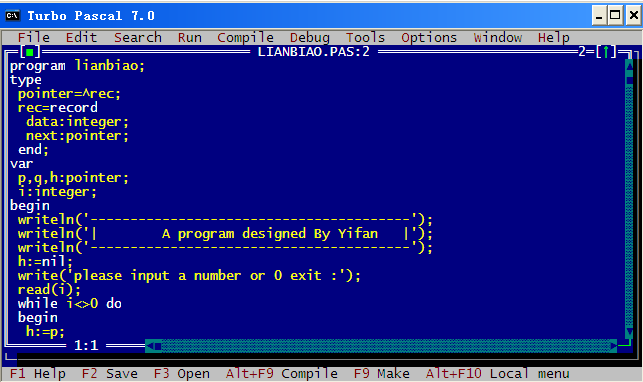
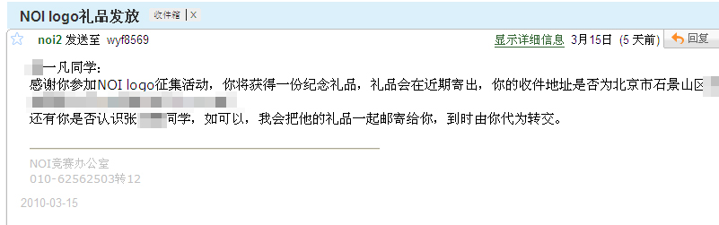

# 总结三周情况 

> 2010-03-20

 

  
 

 

  不得不很杯具的说，这一开学就已经3周过去了。
 

 

  我终于回来了，被回收了三周，感想很多，吾日三省吾身，我想每个人也应该这样，想一想每天自己都做错了什么，什么该做什么不该做，这样才能Improve你的人品。
 

 

  <strong>
   学习方面的问题
  </strong>
 

 

  学习方面确实感觉比上学期花的功夫多了，主要是有动力，至于动力就不用提了，迫不得已而已。
 

 

  但是也不知道这样能否成功，让时间检验一切吧。至少我还有3次机会。
 

 

  <strong>
   生活心态方面
  </strong>
 

 

  突然发现我的世界观 金钱观发生了重大变化，这可能是适应了北方人的生活习性所导致的了，尤其是金钱观发生的变化，使我想得很开，心态很好，自然生活就很顺利，没有过不去的坎。
 

 

  MP4被我意外刷坏了，囧
 

 

  <strong>
   NOIP(全国信息学奥林匹克竞赛)的日子
  </strong>
 

 

  在没有计算机的日子里，NOIP一直陪伴着我，兴趣愈发浓郁，不得不说，这个也似乎成了我的生活动力，有时候在路上发愣，这很可能是我在想程序的思想，在构思，然后写程序，调试程序，但是大多数的时候是不成功的。
 

 

  最近学习了链表，终于弄懂了，可是至今还没熟练，也懒得熟练。
 

 

  
   
 

 

  <strong>
   奖品事件是个杯具
  </strong>
 

 

  近日，收到Noi协会的邮件，说我的奖品要到了，我帮别人代收的，但是。至今还没有收到奖品，杯具了。
 

 

  还有一个是百度的活动，我是入围奖，至今也没有给我发邮件领奖品，杯具了。
 

 

  
   
   
  <strong>
   yifantk不会是个杯具
  </strong>
 

 

  <a href="http://www.yifan.tk/">
   www.yifan.tk
  </a>
  即可访问本空间，hi.yifan.tk恢复了，更多功能正在制作中。
 

 

  <strong>
   天气
  </strong>
 

 

  北方的天气一直很适应，春天了，还下雪。可是3.20日那天下了场沙尘暴，太神奇了，漫天都是黄色的，很黄很暴力？
 

