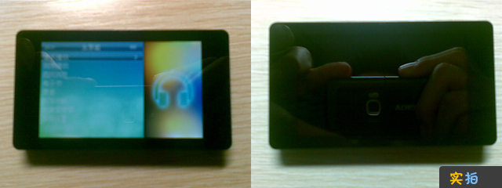
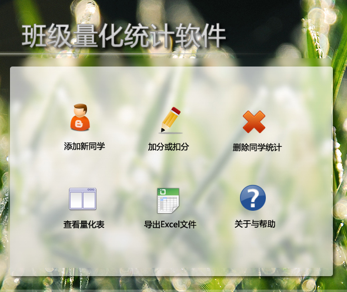
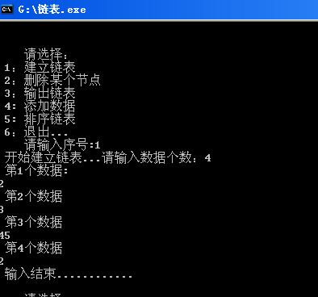

# 总结 -RM970入手 & 参加程序设计比赛 

> 2010-04-04

 

  
 

 

 

 

  先说说
  <strong>
   蓝魔RM970 V2.0
  </strong>
  吧
 

 

  我原来的MP4 ---Q70无故电池挂掉了，估计是到了使用寿命了。
 

 

  没有办法，只有新买一个MP4。 在网上选来选去，选定RM970 V2.0了。
 

 

  看重的就是它的外观和它支持RMVB格式的电影。
 

 

  而且最重要的一点——可以自己美化固件。（今后可能BLOG会有RM970的美化固件放出）
 

 

  价格：270RMB，这价格，在北京还算是比较便宜的吧。
 

 

  4GB的，可支持t-flash卡。Usb 2.0，传输速度比Q70快了好多呢。
 

 

  而且做工 也是很细腻的说，屏幕也很好。400*240 宽屏。
 

 

  经测试，播放rmvb能力一般，至少比我的手机强得多，不会很卡。
 

 

  播放音乐能力，音质还行吧，音效很多可以选择 微软音效之类的，还是不错的。
 

 

  缺点：屏幕易粘指纹，但可以迅速清除。 没有游戏功能 ，没有FM功能 。
 

 

  总之，这款产品应该是一款热销产品吧。
 

 

  
   
 

 

  （看到过北京有卖apple的，都太贵，估计是北京税高的缘故吧）
 

 

  再说说
  <strong>
   参加的程序设计比赛
  </strong>
  的事情。
 

 

  参加了一个市里举办的比赛，设计了一个量化统计软件。
 

 

  通过vb6.0+access实现的。一共才花费了不到10个小时完成。
 

 

  Visual Basic 6.0 + Ms Access（SQL语句读写的原理） + Photoshop + IconCool Editor
   
  Access数据库的读写方面，下了不少功夫，调试了近80多次，还有部分小功能，如
   
  Access文件转换为excel文件的功能，也是想了半天。
   
 

 

  然后自己又用winrar做了一个安装程序-自动注册dll和ocx。
 

 

  总之自己还是很满意的，等到比赛结束之后，该软件就会被我发布的。
 

 

  
   
  软件部分截图
 

 

  <strong>
   链表的那点事儿
  </strong>
 

 

  链表鼓捣了两个礼拜了，终于弄懂了，终于分清了q^与q的区别了。
 

 

  最终做了个最终版的程序：
 

 

  
   
 

