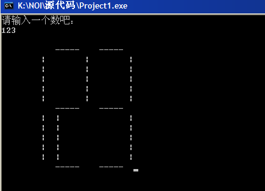

# 小程序 - 数字放大器 

> 2010-06-06

 

  
 

 

  哈，我说过，我要发些小程序。
 

 

  这个程序比较简单。但没什么用，下次制作一个比较有用的。
 

 

  程序名称：数字放大器
 

 

  程序语言：pascal
 

 

  程序描述：
 

 

  输入一个数，然后将该数字放大成 搜狗酷字效果。
 

 

  这个思路是从NOI杂志上看的。经过N次调试而成。
 

 

  具体思路如下：
 

 

  把0123456789都拆分成一个一个的数组，将数组进行逐输出，数组是字符型的。
 

 

  有的同学提出使用case语句直接输出不是很好嘛？。。那样是实现不了连续输出的。
 

 

  1.程序开始
 

 

  2.读入一串数
 

 

  3.拆数到小数组
 

 

  4.按数组的编号进行输出
 

 

  5.得到酷字，并结束。
 

 

  运行结构如下：
 

 

  
 

 

  具体代码如下：
 

 

 

 

  <code>
   program KUZIconvert;
    
   var
    
   k:integer;
    
   procedure sj(m:integer) ;
    
   const
    
   sise=5;
    
   var
    
   a: array[0..9] of char =('-',' ','-','-',' ','-','-','-','-','-');
    
   b1:array[0..9] of char =('|',' ',' ',' ','|','|','|',' ','|','|');
    
   b2:array[0..9] of char =('|','|','|','|','|',' ',' ','|','|','|');
    
   c: array[0..9] of char =(' ',' ','-','-','-','-','-',' ','-','-');
    
   d1:array[0..9] of char =('|',' ','|',' ',' ',' ','|',' ','|',' ');
    
   d2:array[0..9] of char =('|','|',' ','|','|','|','|','|','|','|');
    
   e: array[0..9] of char =('-',' ','-','-',' ','-','-',' ','-','-');
    
   ans:array[1..255] of integer;
    
   j,g,f,i,k:longint;
    
   l:integer;
    
   n:string[255];
    
   begin
    
   l:=1;
    
   str(m,n);
    
   k:=length(n);
    
   for i:=k downto 1 do      {拆数}
    
   ans[i]:=ord(n[i])-48;
    
   writeln;
    
   g:=1;
    
   while (ans[g]=0) and (g&lt;k) do inc(g);
    
   for i:=g to k do
    
   begin
    
   write('  ');
    
   for j:=1 to sise do write(a[ans[i]]);
    
   write('  ');
    
   end;
    
   writeln;
    
   for f:=1 to sise do
    
   begin
    
   for i:=g to k do
    
   begin
    
   write('  ',b1[ans[i]]);
    
   for j:=1 to sise do write(' ');
    
   write(b2[ans[i]]);
    
   end;
    
   writeln;
    
   end;
    
   for i:=g to k do
    
   begin
    
   write('  ');
    
   for j:=1 to sise do write(c[ans[i]]);
    
   write('  ');
    
   end;
    
   writeln;
    
   for f:=1 to sise do
    
   begin
    
   for i:=g to k do
    
   begin
    
   write('  ',d1[ans[i]]);
    
   for j:=1 to sise do write(' ');
    
   write(d2[ans[i]]);
    
   end;
    
   writeln;
    
   end;
    
   for i:=g to k do
    
   begin
    
   write('  ');
    
   for j:=1 to sise do write(e[ans[i]]);
    
   write('  ');
    
   end;
    
   end;
    
   begin
    
   writeln('请输入一个数吧：');
    
   read(k);
    
   sj(k);
    
   readln;
    
   readln;
    
   readln;
    
   end.
    
  </code>
 

 

  严重声明：这个和NOI比赛没有任何关系，纯属个人娱乐。
 

 

  下回有可能发布（正在编写中）：
   
 

 

  1.算式逐步运算工具
 

 

  2.分数计算器
 

 

  3.Pascal结构化程序
 

 

  发布时间：N万年后
 

