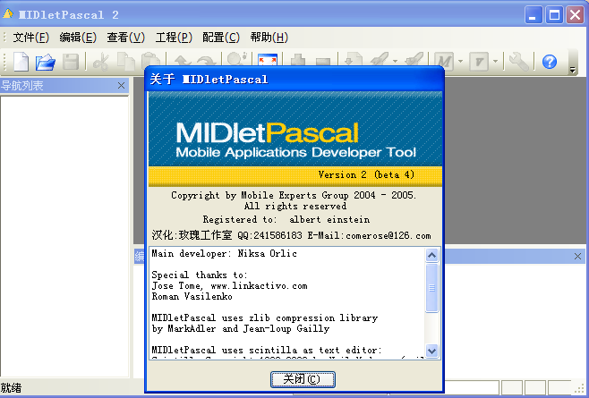
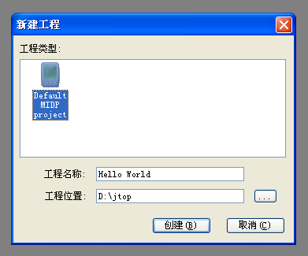
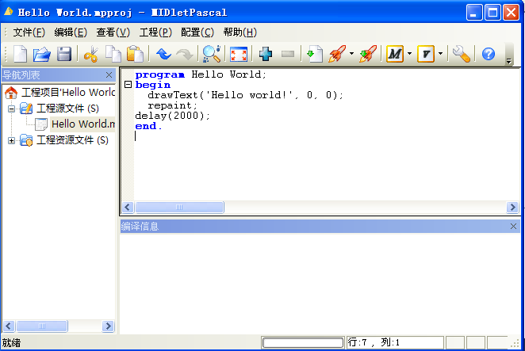
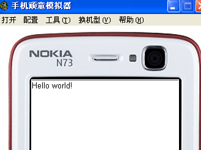

# MIDletPascal——用Pascal语言编写手机应用程序(J2ME) 教程 

> 2010-06-08

 

  
   
   
  MIDletPascal，好软件，个人感觉很不错很不错。
 

 

  因为在编程领域，我非常熟悉object pascal语言，MIDletPascal是以object pascal为标准的编译器，可以用pascal语言编写手机软件游戏（J2ME）。
 

 

  下载试了试，很容易操作
 

 

  使用object pascal语言的IDE还有delphi,turbo pascal,free pascal,lazarus等等，但他们都是直接编译／解释成可执行文件EXE
 

 

  今天无意间找到了如此神通广大的软件，先膜拜两下
 

 

  <strong>
   第一步：下载及安装
  </strong>
 

 

  首先但我的网盘上下载
 

 

  下载地址：
  <a href="http://www.uushare.com/user/yfblog/file/3114603">
   http://www.uushare.com/user/yfblog/file/3114603
  </a>
 

 

  解压缩后，得到如下：
 

 

  小型java模拟器.exe
   
  MPInstall2.exe
   
  中文版使用说明.txt
   
  MpIDE.exe
   
  MPHelp_ru.chm
 

 

  首先运行MPInstall2.exe，安装它待安装完毕后。
 

 

  把MpIDE.exe复制到安装目录，替换原程序（汉化过程）
 

 

  然后打开MpIDE.exe，菜单栏-配置-注册信息。
 

 

  user: Albert Einstein
   
  code: D6Qw8p1CHW7xY7D
 

 

  关闭它。
 

 

  然后再安装，小型java模拟器.exe即可。
 

 

  下载再启动MIDLETPASCAL的时候，就完美了。
 

 

  <strong>
   第二步：熟悉开发环境
  </strong>
 

 

  打开开始菜单-所有程序中的MIDletPascal 2软件。
 

 

  进入如图的软件界面：
 

 

  
 

 

  对于这种开发环境，经常使用delphi或lazurus的用户是很熟悉的。
 

 

  下面我们来写我们第一个J2ME程序——hello world
 

 

  文件-新建工程
 

 

  
   
   
  很明显，右边是编辑框，左边工程的设置下面是编译信息。
 

 

  
 

 

  下面我来解释下代码：
 

 <code>
  

   program HelloWorld;      {这个是设置J2ME程序名称}
    
   begin                               {程序开始}
    
   drawText('Hello world!', 0, 0); {使用drawtext过程 让手机屏幕上显示 HELLO WORLD字样，坐标为0,0}
    
   repaint;                                        {绘图}
    
   delay(2000);                                {2000毫秒后结束该程序}
    
   end.
    
  

 </code>
 

  比起J2ME语言来说，虽然不如JAVA语言简单开放，但是比java语言严谨，易懂。
 

 

  好了，开始编译，按下F7开始编译。
 

 

  一会就看到了编译成功的字样。
 

 

  找到工程目录\bin\下
 

 

  会发现两个文件，一个是jar文件，一个是jad文件。
 

 

  双击那个jar文件，会用手机顽童打开。
 

 

  
 

 

  经过20秒后，程序自动结束。我们的第一个helloworld程序，就这样开发完毕了。
 

 

  <strong>
   第三步：MIDlet Pascal的函数和过程
  </strong>
 

 

  在语法，变量上，是和freepascal完全一样的，不过midlet有很多函数和过程。
 

 

  下面介绍一下。
 

 

  所有函数，过程如下：
 

 <code>
  

   drawArc                                drawEllipse                                  drawImage
    
   drawLine                                   drawRect                              drawRoundRect
    
   drawText                                fillEllipse                                   fillRect
    
   fillRoundRect                               getColorBlue                              getColorGreen
    
   getColorRed                               getColorsNum                                  getHeight
    
   getImageHeight                              getImageWidth                            getStringHeight
    
   getStringWidth                                   getWidth                             isColorDisplay
    
   loadImage                                       plot                                    repaint
    
   setClip                                   setColor                             setDefaultFont
    
   setFont                              getKeyClicked                              getKeyPressed
    
   keyToAction                                      delay                             getCurrentTime
    
   getDay                                    getHour                                  getMinute
    
   getMonth                          getRelativeTimeMs                                  getSecond
    
   getWeekDay                                    getYear                                 getYearDay
    
   abs                                       acos                                       asin
    
   atan                                      atan2                                        cos
    
   exp                                       frac                                        log
    
   log10                                        pow                                       rabs
    
   sin                                        sqr                                       sqrt
    
   tan                                  toDegrees                                  toRadians
    
   trunc                                       copy                                    getChar
    
   integerToString                                     length                                     locase
    
   pos                                    setChar                            stringToInteger
    
   stringToReal                                     upcase                                 addCommand
    
   choiceAppendString                    choiceAppendStringImage                     choiceGetSelectedIndex
    
   choiceIsSelected                                  clearForm                              createCommand
    
   emptyCommand                              formAddChoice                               formAddGauge
    
   formAddImage                               formAddSpace                              formAddString
    
   formAddTextField                                formGetText                               formGetValue
    
   formRemove                                formSetText                               formSetValue
    
   getClickedCommand                           getTextBoxString                           menuAppendString
    
   menuAppendStringImage                       menuGetSelectedIndex                             menuIsSelected
    
   playAlertSound                              removeCommand                                  setTicker
    
   showAlert                                 showCanvas                                   showForm
    
   showMenu                                showTextBox                        addRecordStoreEntry
    
   closeRecordStore                          deleteRecordStore                     deleteRecordStoreEntry
    
   getRecordStoreSize                            openRecordStore                       readRecordStoreEntry
    
   addHttpBody                              addHttpHeader                                  closeHttp
    
   getHttpHeader                            getHttpResponse                                 isHttpOpen
    
   openHttp                            sendHttpMessage                              setHttpMethod
    
   smsIsSending                               smsStartSend                          smsWasSuccessfull
    
   getPlayerDuration                                 openPlayer                             setPlayerCount
    
   startPlayer                                 stopPlayer                              closeResource
    
   openResource                                   readByte                                   readLine
    
   resourceAvailable                                     assert                                        chr
    
   debug                                getProperty                                       halt
    
   isMidletPaused                                        odd                                        ord
    
   random                                  randomize
  

 </code>
 

  未完待续。。。
   
 

