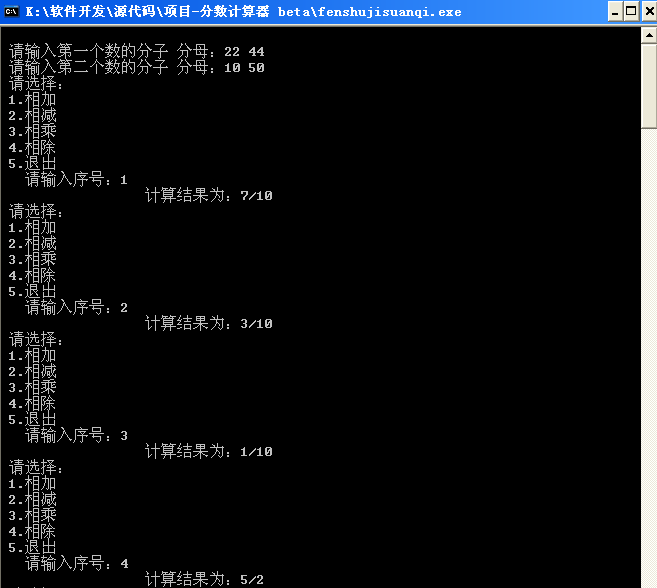

# 数论的简单应用——分数计算器 

> 2010-06-08

 

  
   
   
  上次说过，要写个分数计算器，今天晚上调试了下，OK。
 

 

  于是就发布上来了，做之前以为很难，其实相当简单的说。
 

 

  只要自己做个模拟运算就可以发现分数计算的算法。
 

 

  那不过也发上来了。
 

 

  能计算加法 减法 乘法 除法四种基本运算，并约分。
 

 

  主要用到的算法：最小公倍数，最大公约数，交换。
 

 

  加法的原理：结果的分子 是两个数的分子分母交换相乘相加的和，结果的分母是 两分母的最小公倍数
 

 

  减法的原理与加法类似。
 

 

  乘法的原理：分母相乘，分子相乘。
 

 

  除法的原理：第二个分数上下交换后，使用乘法原理。
 

 

  约分的原理：分子分母分别除以分子分母的最大公约数得到的数组合成新的分子分母。
 

 

  不多说了，看程序代码吧。
 

 <code>
  

   program fenshujisuanqi;
    
   var
    
   a,b:array[1..2] of integer;
    
   c,d,n:integer;                  {c是分母,d是分子}
  

  

   procedure swap(a,b:integer);     {交换}
    
   var
    
   c:integer;
    
   begin
    
   c:=a;
    
   a:=b;
    
   b:=c;
    
   end;
    
   function gcd(a,b:integer):integer;  {求最大公约数}
    
   begin
    
   if b=0
    
   then
    
   gcd:=a
    
   else
    
   gcd:=gcd(b,a mod b);
    
   end;
    
   procedure yf;                        {约分}
    
   var
    
   l:integer;
    
   begin
    
   l:=gcd(c,d);
    
   c:=c div l;
    
   d:=d div l;
    
   end;
    
   function lcm(a,b:integer):integer;      {求最小公倍数}
    
   var t:integer;
    
   begin
    
   if a&lt;b then swap(a,b);
    
   lcm:=a;
    
   while lcm mod b&lt;&gt;0 do
    
   inc(lcm,a);
    
   end;
    
   procedure jia;                        {加法运算}
    
   begin
    
   c:=lcm(a[2],b[2]);
    
   d:=(c div a[2])*a[1]+(c div b[2])*b[1];
    
   end;
    
   procedure cheng;                      {乘法运算}
    
   begin
    
   c:=a[2]*b[2];
    
   d:=a[1]*b[1];
    
   end;
    
   procedure jian;                    {减法运算}
    
   begin
    
   c:=lcm(a[2],b[2]);
    
   d:=(c div a[2])*a[1]-(c div b[2])*b[1];
    
   end;
  

  

   procedure chu;                    {除法运算}
    
   begin
    
   c:=a[2]*b[1];
    
   d:=a[1]*b[2];
    
   end;
    
   begin
    
   writeln;
    
   write(' 请输入第一个数的分子 分母：');
    
   read(a[1],a[2]);
    
   write(' 请输入第二个数的分子 分母：');
    
   read(b[1],b[2]);
    
   repeat
    
   begin
    
   writeln(' 请选择：');
    
   writeln(' 1.相加');
    
   writeln(' 2.相减');
    
   writeln(' 3.相乘');
    
   writeln(' 4.相除');
    
   writeln(' 5.退出');
    
   write('     请输入序号：');
    
   read(n);
    
   case n of
    
   1:jia;
    
   2:jian;
    
   3:cheng;
    
   4:chu;
    
   5:exit;
    
   end;
    
   yf;
    
   writeln('                    计算结果为：',d,'/',c);
    
   end;
    
   until n=5 ;
    
   readln;
    
   readln;
    
   readln;
    
   end.
  

 </code>
 

   
  
 

 

  关于那个pascal 代码结构化 的工程，正在构想思路，正在参考C语言版的pascal构词法。
 

 

  PS:今天把计算机的ubuntu重新安装到了10.04，感觉比以前更干净了，动画效果有所精简。
   
  把手机操作系统重新做了一下，更快了。
 

 

  欢迎指出错误和最优算法。
 

