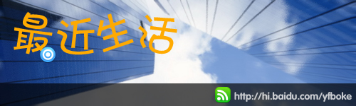
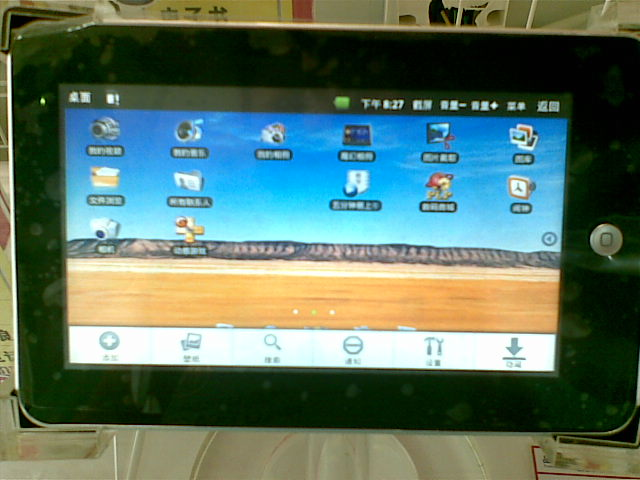
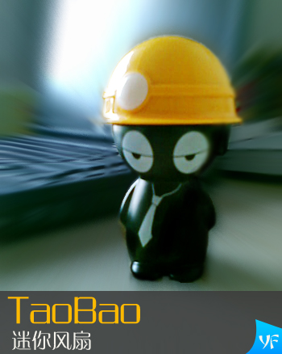
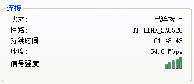
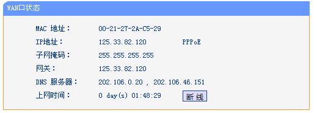
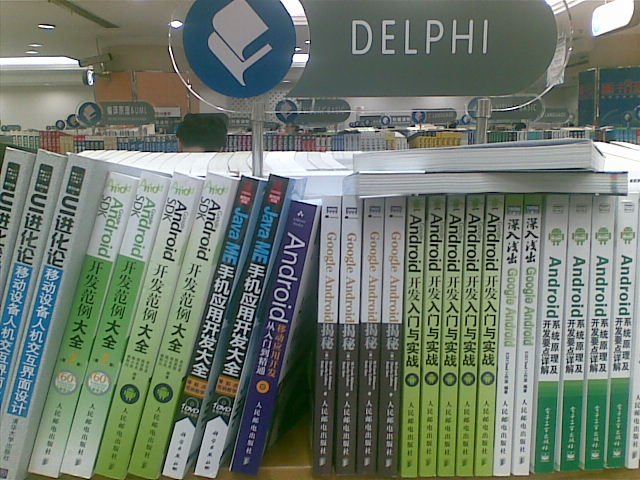

# 最近生活 

> 2010-07-21

 

  
 

 

   
  我还活着...大概很长时间没写了。
 

 

  主要是没时间写blog。今天写写吧。
 

 

  其实暑假的计划安排得满满的，虽然如此，还是抽时间写写吧。
 

 

  写写放假后的事情吧。
 

 

  1.亲身体验android
 

 

  我家附近的超市里，有卖电器的，里面有一个叫什么飞酷电脑的，999元，其实挺贵的，上手玩了一下，效果不佳。
 

 

  其实我还没有玩android的时候，挺期待/喜欢它的，只是因为它的软件增长速度。
 

 

  但是通过体验，感觉总体上还是不如iOS，终于清醒的认识到，android实质就是一个移动版的linux操作系统。
 

 

  谍照如下图：
 

 

  
 

 

   
  2.网购
 

 

  因为我要去上海看世博会，所以，需要一些消夏产品，要知道，在外面排队是很热的。
 

 

  所以决定在taobao上买一个mini小风扇，其实这种小风扇，记得小时候，在地摊上有卖的，现在北京的地摊上没有了，所以，就只能网上买了。
 

 

  其实价格挺便宜的，6元，只不过加了10元的邮费，就稍微贵了点了16元。
 

 

  谍照如下：
 

 

  
 

 

  3.轻松拿到了邻居家的wifi信号
 

 

  先看图：
 

 

  
 

 

  速度还行，起码比3G快，其实没有跟邻居打招呼，是直接的蹭网的。
 

 

  起初连接上是不能上网的，后来想想这是tp的，应该有后台管理的。
 

 

  于是进入192.168.1.1，默认密码竟然进去了。
 

 

  
 

 

  原来就在这里呀，连接一下，就OK了。
 

 

  从系统日志上看，该邻居平时不怎么上网，为了防止他的上网费浪费，我帮他上了吧。
   
   
   
  4.图书大厦
 

 

  前几天去了趟西单图书大厦，本来想找找NOIP的书着，结果发现，竟然一个也没有！
 

 

  在奥林匹克竞赛类，只有数学 物理 化学 生物，竟然没有信息！
 

 

  在数据结构类，竟然都是大学的课程的用书！
 

 

  在delphi书中，让我大吃一惊，原来——delphi就是传说中的android？iphone？，全都是这类SDK的书籍，囧死我了，delphi的辉煌哪去了？
 

 

  谍照如下：
 

 

  
 

 

   
  没办法，只能taobao了。
 

 

  5.人人网
 

 

  总玩人人网，就没顾得上blog了，人人网比较真实，一般都是我的同学，而我的blog一般都是志同道合的朋友们，人人网，我会写点心情日志，分享文章之类的，blog就不是啦~
 

 

  暑假打算：去看世博会 学习
 

