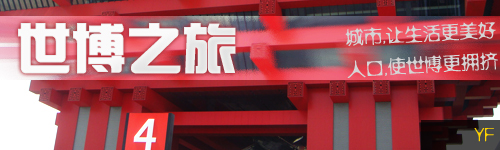
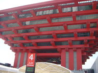
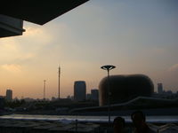
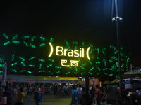
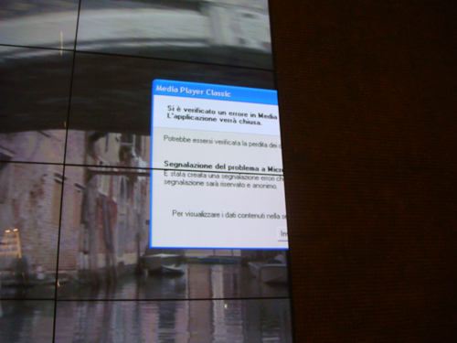
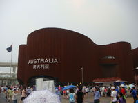

# 世博之旅 [图片+视频] 

> 2010-08-03

 

  
 

 

  以下是本人世博三天所见所闻，纯手机撰写：
 

 

  去之前：
 

 

  嗯…从今天开始，我就开始踏上世博之旅了，去世博会三天，是这样安排的，先做软卧从北京到宁波，再到上海，然后再做软座回北京，说是三天，其实实际时间加起来，只有短短的两天。
 

 

  时间不长，所以要好好的玩…
 

 

  软卧：我大概有几年没做火车了，现在的北京站火车检票时，再也不是以前的喇叭声：“XXX号开始检票”，而是：“XXX号旅客可以开始上车了”，让人有种耳目一新的感觉吧。
 

 

  软卧上是四个卧铺，有门的那种，恐怕软卧就是火车的头等舱吧，外面还有一个 220 V的电源，当天晚上，还有一个人用竟然把MACBOOK插在上面看了一个晚上的电影。
 

 

  我呢？只好在铺上用手机玩百战天虫，极品飞车…好无聊啊，看到果粉，简直就是羡慕嫉妒恨啊…
 

 

  我的下铺是一对母子，那个小孩特别的强悍，大概五六岁吧，拿着他妈妈的iphone听其自带的铃短信声，装打电话，囧。
 

 

  第一天：
 

 

  这么累了，我已经上车了，还是觉得接着写，诶…
 

 

  今天早上八点就从宁波出发了，是跟着旅游团走的，坐了五个小时的汽车，途经杭州湾大桥。有点困，听着音乐，音量开得比较大，晃晃悠悠的，开到世博园区了，那时候，大概是一点多了，等拿到入门票后，已经是两点多了，下午入园不用排队的，人很少的。
 

 

  因为我们是从八号口（后滩）进入的，所以是需要坐公交车才能到中国馆的。
 

 

  说一下交通工具，有地铁，公交，轮船。出行方式很多，但人依然很多。
 

 

 

 

  
   
  中国馆都是预约制，不要天真的以为预约就不用排队，其实你不预约，你是进不去的，当然要排队，人多得是，排队方式是绕圈型的，真的很长很长，进馆要排队，到馆里进入展厅也是需要排队的，排队的时候最好准备小板凳，否则，真的是要热，累死的。
 

 

  等你排完了，已经排了大约两个小时的队了，不过这比沙特要短得多的多，排队的时候，有喷雾设施，但天气真的热起来，这个东西管不了多大作用的。
 

 

  进入中国馆第一个展厅是中国进三十年的变化，一些旧家具，都陈列出来了，不过这段没什么意思的，因为，都是中国人，大家都知道。
 

 

  紧走两步，进入第二个展区，就是清明上个图，那个LED屏幕真的非常长，非常大，是我平生见到最大的一个，堪比奥运会开幕式的墙上的那个。至于“图”，其实不是图，是视频，分辨率很高，估计这么大的视频，是要用超级计算机制作的，少说这短短三十秒的循环超高清逼真视频也要有5GB。“图”的旁边是条人造的小河流。
 

 

  接下来进入第三个展区，“奇幻之旅”，这个也是需要排队的，因为是要做那个百人观光轨道车的。（免费）
 

 

  时间不长，大概二十分钟吧，本来没抱什么期盼，因为这是最后一个吧，也是太累了，本来就没想去中国馆，没想到，这个竟然是压轴的。确实比较奇幻，穿越各种桥，有自动的音频讲解，观光，挺不错的。你会看到中国从古至今各种建筑，有种穿越时空的感觉。
 

 

  至于中国馆其他的，就是一些小朋友们的简笔画。真的没什么意思的，就像到了幼儿园…
 

 

  随后去了尼布尔馆，这个国家是信佛的吧，陈列着佛像，菩萨，没什么好玩的，只是排了二十分钟的队伍，进去了一个大寺庙。里面有特别多的商店，特别贵。
 

 

  出来的时候大概是六点多了，又去了印度馆，印度馆排队时间比较短，一个多小时吧，场馆建设是印度风格的大球体，进去才知道，只是一个小小影院，介绍印度的风土人情的。不过要比尼布尔馆好多了。
 

 

  一般来说，在馆内待的时间是不长的，但排队简直无法忍耐，城市，让生活更美好？这样排队进入城市能美好吗？
 

 

  
   
 

 

  待到晚上，主题馆转了转，都不错，提一下，公众参与馆是不错的，那里有相当过时的摄像头识别，开始我以为是光感手势识别呢，那对于大部分人来说会感到很新鲜的。
 

 

  晚上的夜景也不错的，回到预定的宾馆，看电视，是IPTV，挺不错的，中国电信黑钱不少啊…
 

 

  第二天：
 

 

  还是接着写吧，先说说今天去了哪些馆吧。
 

 

  石油馆（排队六个小时），国家电网，荷兰馆，俄罗斯馆，意大利馆，美国馆，立陶瓦馆…
 

 

  石油馆：排了很长很长的队伍，目测队伍的用路程为 70*21 +60＝ 1530 米，走走停停，一个上午的时间都浪费在排队上了，若是排到一半放弃，就会觉得很不值得，若是一直排下去，第一口渴难耐，第二没有厕所，第三太阳炙烤，第四心烦意乱，第五血压升高…没有办法，排队的人没有几个人放弃的，只有坚持，忍耐的。
 

 

  等到排到我们那，就已经是下午了，进入馆内，是4D电影院，跟外面的4D电影院观看效果区别不大，排六个小时是不值得的。
 

 

  国家电网馆：只去了那个 720 度光电短片是不错的
  
   
 

 

  荷兰馆：没什么好看好玩的，是露天的，只是跟那个老外照相，跟他说：“MAY I TAKE A PHOTO WITH YOU?”，他会很乐意的回答，“YEAH OKAY”…
 

 

  意大利馆：比较时尚吧，陈列意大利的各种设计，空间利用也不错，只是发现一个很有意思的大屏幕，“wmp崩溃时候的错误报告”，重要的是，是XP意大利遇的。
 

 

   
  
 

 

  其他的去过的场馆都没什么意思的。
 

 

  再说说餐饮吧，都非常贵，尤其是场馆里的，至于世博轴那边的，都是一些餐饮品牌，KFC，真功夫等，但种类单一，施行套餐制，基本都没有或者不开空调，因为吃饭属于刚性需求，商家开不开都无所谓，尽管天气又多热，都会有人需要吃饭的，所以吃的时候会很热，忍一忍吧…
 

 

  第三天：
 

 

  今天天气不错，去了德国馆，中国信息网馆，马来西亚馆，纹来馆，澳大利亚馆，中美联合馆。
 

 

  德国馆：排队排了四个小时，不过有了之前的石油馆，排队应该是没什么问题的。
 

 

  德国馆的空间利用得很不错，展馆倒是不像中国馆那么臃肿，但是可以看到的东西倒是蛮多的，也有许多参与体验的，各种德国风俗的介绍，相当多的LED小屏幕，不过这些不重要，里面也是相当凉快的，冷气给得相当的充足，德国馆压轴的就是一个巨大球体，通过馆内互动把这个大球启动，推动，主持人是一个可爱的美女（中国），帅哥（德国，说英语），配合的很好，真的挺好看的。
 

 

  纹来馆：纹来馆没什么，可以答题拿赠品，答案是BBBB。
 

 

  澳大利亚馆：这个场馆挺好的，无论从空间利用到节目安排都是不错的，更重要的一点，是它的排队时间不算长，亮点： 360 度环绕师电影，里面相当凉爽，深海潜水员表演。
  
 

 

  其他的场馆基本没什么意思。记得在排澳大利亚馆的时候，旁边的泰国馆的泰国人（志愿者），用喇叭喊：“泰国馆由此进入，泰国馆没有人妖！！！”…
 

 

  当逛完澳大利亚馆后，基本精疲力竭了，打算坐火车回北京了。
 

 

  做地铁七号线导一号线，上海的地铁和北京的不一样，上海大，地铁的票价不统一，而且地铁一号线根北京的明显人少多了…
 

 

  这不，我已经到火车上了，坐在我前面是两个外国人，囧，他们竟然做错位子了…
   
 

 

   
 

 

  德国馆能量之源视频：
 

 

  <embed allowscriptaccess="never" height="390" loop="false" menu="false" play="true" pluginspage="http://www.macromedia.com/go/getflashplayer" src="http://player.youku.com/player.php/sid/XMTk0ODkwNzA0/v.swf" type="application/x-shockwave-flash" width="450" wmode="window">
  </embed>
 

 

 

 

  澳大利亚馆：
 

 

  <embed allowscriptaccess="never" height="390" loop="false" menu="false" play="true" pluginspage="http://www.macromedia.com/go/getflashplayer" src="http://player.youku.com/player.php/sid/XMTk0OTMzNjE2/v.swf" type="application/x-shockwave-flash" width="450" wmode="window">
  </embed>
 

