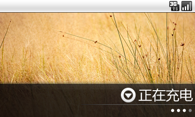
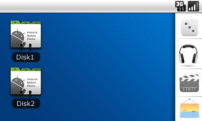
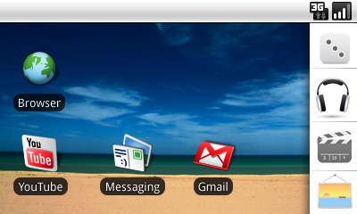
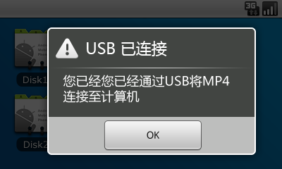

# 最近状况-微博,制作MP4仿Android固件 

> 2010-08-12

 

  
   
   
   
  首先，不得不说的是，我早就开始玩微博了，不过我有众多网站的微博账号，所以我就用了嘀咕里的滴神，一次性发微博，哈哈。
   
  说下吧，我各个网站的账号，各位有的话，跟随我吧~哈哈。
   
  新浪微博：一凡干啥呢
   
  做啥：yfboke
   
  嘀咕：yfss
   
  jiwai：yfss
   
  饭否：yfblog
   
  再说说关于这两天忙什么吧。忙着制作RM970 V2.0（MP4）固件呢，我敢保证，这是我做的最好看的一次固件，最能装B的固件，因为我MP4比较垃圾，但又想玩android，就制作了仿android固件。
   
  话说制作这个固件相当辛苦的，绝非使用android系统的截图，除了那些android小图标是抠出来的，其他的都是纯ps制作，已经制作了39个图片了，开机画面就占了20个，但保质保量。
   
  尤其是那个充电画面（会动的，四个图片一个周期而已），个人相当欣赏，自我陶醉中...
   
  固件部分截图如下：
   
   
  
   
   
  
   
  风格1（不推荐）
   
  
   
  风格二（推荐）
   
   
  
   
   
   
  等全部制作完毕后，我会发布的~！！！
 

