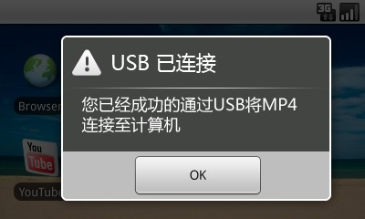
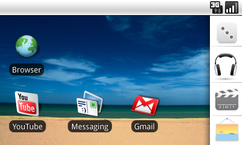
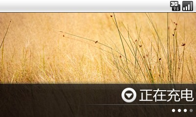
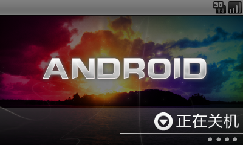
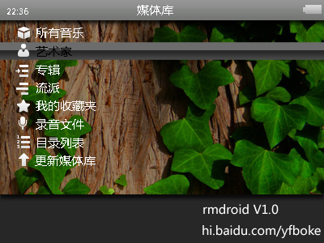

# RM970 V2.0美化固件——rmdroid,仿Android,美化程度极高 

> 2010-08-15

 

  
   
   
  固件我是做好了，关于固件内的各种psd文件，如若需要请回复，再考虑是否全部开源。
   
  至于其他RK系列的机型，想要我的固件，我会提供所有文件的打包版本，自己去替换原来系统固件的图片即可，至于打包版本，将在一周内发布，本人需要整理一下。
   
  固件可能做得不好，谢绝批评，做固件是要经过很多次调试的。
   
  我总感觉，我的固件要比其他网上的人做的要好，因为我改的比较全面，小到小图标，播放图标，大到背景图片，字体。
   
  固件名称：rmdroid
   
  美化版本：1.0
   
  固件版本：1.1.6
   
  美化作者：Yifan
   
  作者邮箱：i@yifan.tk
   
  固件成功机型：RM970 V2.0
   
  固件理论适合芯片：RK2705
   
  更新日志：
   
  01.已经美化开机画面，为android系统默认开机画面
   
  02.已经美化关机画面，效果绝美
   
  03.已经美化usb连接画面，仿android系统的USB连接
   
  04.已经美化主界面，主界面已经去除全部文字（“如 视频播放 等”），以达到美化效果
   
  05.已经美化主界面的侧栏，上下键切换，效果很好
   
  06.已经美化充电画面，效果绝美
   
  07.已经美化子页面，即资源管理器下的背景，音乐播放下的背景，有四种桌面可供选择，效果不错
   
  08.已经美化各类小图标，包括音乐播放界面的小图标，换成清爽的白色图标，淡雅风格
   
  09.已经美化各类细节方面如提示框，按钮，跳转时间等图片
   
  10.已经美化系统字体为微软雅黑字体，更加美观
   
  11.已经美化计时器的应用界面
   
  12.已经美化播放时的播放图标，暂停图标，停止图标，前进后退图标
   
  13. 已经美化给类进度条
   
  14.已经优化播放界面下面的播放提示栏，已经将透明度调为0%，以免快进后退时挡住字幕
   
  15.放弃固件风格1，制作太麻烦，改用固件风格2
   
  版权声明：
   
  本美化固件已经花费作者整整几天的制作时间，并不是像某些同志们那样，随便找个图片就替换了的，经过近 20多次的实机调试，经过100 多次的PS，大部分（90%）图片均为YiFan创作，改的细节方面很多，让固件真正达到美化的目的，而不是替换桌面的目的。
   
  固件内没有任何版权信息，因为我想，美化固件若是再加上版权岂不是丑化了。
   
  本固件欢迎转载，最好注明本文地址，谢谢！
   
  修改明细如下：
   
  给类界面图片：\RESOURCE\BID\BMP0.BIN
   
  语言为配置文件（去主界面的字）：\RESOURCE\SID\STRINGID.BIN
   
  更改字体：\RESOURCE\FONT
   
  更改字体：\RESOURCE\LANGUAGE\CHINESE
   
  警告：升级固件前，请先查看下系统固件版本，如果是 1.1.1，1.1.3，1.1.6，1.1.9均可下载正常使用，
   
  否则使用我的固件后，将会出现系统如黑屏，白屏，请开机按M键连接计算机刷回原来的固件或将芯片上的脚线挑过去进行重新刷机。
   
  关于旁边的侧栏:
   
  由 于没有文字，初次使用，肯定会不习惯，不过用过10次以上，绝对会很熟练的，毕竟是图标显示，又不是什么都没有。
 

 

  升级方法：
   
  将rm970 V2.0插入计算机，将压缩包文件970v20.img复制到rm970 V2.0中，安全弹出硬件，打开rm970 V2.0，进入设置-系统设置-固件升级-确定
   
  等待20秒，即可自动重启，看到rmdroid版的开机画面了。
   
   
  
 

 

  
 

 

  
 

 

  
 

 

  
   
   
   
 

 

  
   
   
   
 

 

  下载地址：
   
  <a href="http://www.rayfile.com/files/78c66c6e-a87f-11df-85c1-0015c55db73d/" target="_blank">
   http://www.rayfile.com/files/78c66c6e-a87f-11df-85c1-0015c55db73d/
  </a>
 

 

  投票:
 

