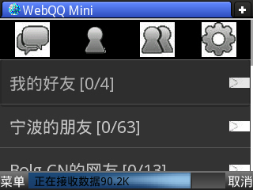

# UCMobile评测 

> 2010-08-26

 

  转自：
  <a href="http://www.yifan.tk/?p=42" target="_blank">
   http://www.yifan.tk/?p=42
  </a>
 

 

  
   
   
  作为Uc的忠实用户，本人对UC的新产品——UCMOBILE做出评测现在UCmobile已经是公测版本了。如同当年的OPERAmobile，UCmobile和他拥有者相似的名字。于是笔者从官网上下载了公测版本。作为Uc的忠实用户，本人对UC的新产品——UCMOBILE做出评测现在UCmobile已经是公测版本了。如同当年的OPERAmobile，UCmobile和他拥有者相似的名字。于是笔者从官网上下载了公测版本。 好了，现在开始评测1.内存占用内存占用为：4.1MB 这一点是和OPERAMOBILE是一模一样的。2.UI设计
 

 

  UI方面采用UCWEB7系列的传统UI，界面和UCWEB7.3极其相似。
 

 

  
   
   
  这是启动画面
 

 

  
   
 

 

  同样是差不多的UI，这个UI让人感觉没有UCWEB那种成熟稳重
 

 

  
   
 

 

  历史记录，比UCWEB的好多了，分类详细
 

 

  
   
 

 

  系统设置，设置选项中多，不列举了
 

 

  
   
 

 

  三种浏览方式
 

 

  
   
 

 

  和UCweb相似的下载界面
 

 

  
   
 

 

  搜索界面
 

 

  3.网页浏览
 

 

  浏览器的主要职责就是网页浏览，那么浏览方面呢？
 

 

  
   
 

 

  首先到163邮箱看看吧。 不难看出，显示得不是很好，而且很费流量，但比OPERAMOBILE省点。 尤其是网页渲染方面，都差了很多很多。 显得呆板僵硬。
 

 

  
   
 

 

  页面显示不全？
 

 

  
   
 

 

  竟然连PNG都没有透明效果？
 

 

  4.流量流量方面：比UCWEB多，比OPERA MOBILE少
  <strong>
   5.优点
  </strong>
  省流量，完全的显示JS，ALEX等效果
  <strong>
   6.欠改进之处
  </strong>
 

 

  1.UI的稳定方面的问题
 

 

  2.网页的压缩详细设置
 

 

  3.PNG的更强化的支持
 

 

  4.网页渲染
 

 

  5.系统设置里面的字体大小问题
 

